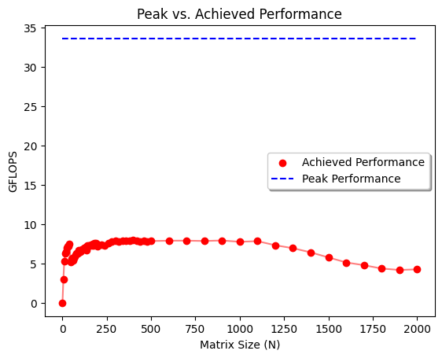

[](https://classroom.github.com/a/z6CYgFxj)

# Project 1: Memory Hierarchies and Performance of Serial Applications

## Due: EOD, 23 January

## Learning goals

In this project you will explore how memory hierarchies affect performance for serial applications.

- arithmetic intensity: how to compute; divides; memory access
- at least 2 different system architectures. Compare and contrast.

All of these aspects of serial applications are transferable to parallel applications, as we shall see later in the course.

## Warm-up

Review the section in [HPSC](../assets/EijkhoutIntroToHPC2020.pdf) on computing arithmetic intensity for given compute kernels.
Then, as a group, compute the arithmetic intensities of the following kernels in units of FLOPs/byte, assuming 8 bytes per float.

```C
  Y[j] += Y[j] + A[j][i] * B[i]
```

```C
  s += A[i] * A[i]
```

```C
  s += A[i] * B[i]
```

```C
  Y[i] = A[i] + C*B[i]
```

Included a table in your project report listing the arithmetic intensities for these kernels.

Group 6 warm-up results are in the table below:

|Kernel|Operations|Memory access|Arithmetic Intensity|
|------|----------|-------------|--------------------|
|Y[j]+=Y[j]+A[j][i]*B[i]|3|4|3/4(8)bytes = 3/32 FLOPs/byte|
|s+=A[i]*A[i]|2|1|2/1(8)bytes = 1/4 FLOPs/byte|
|s+=A[i]*B[i]|2|2|2/2(8)bytes = 1/8 FLOPs/byte|
|Y[i]=A[i]+C*B[i]|2|3|2/3(8) bytes = 1/12 FLOPS/byte|

## Part 1: Matrix-matrix Multiplication

In this first part of the project, you will test the performance of the basic matrix-matrix multiplication operation as a function of matrix size on multiple compute platforms. Complete the following using at least two different compute architectures (e.g., your laptop and HPCC, or two different node architectures on HPCC).

1. With your group, write a program that multiplies two matrices together (see: <http://mathworld.wolfram.com/MatrixMultiplication.html>). Use GitHub to manage the code development and version history.

   Done.

2. For a given matrix size _N_, what is the total number of floating point operations performed by this operator?

    The total number of floating point operations peformed by this operator is `2N^3` since there are 2 operations in the inner loop (addition and multiplication) and 3 loops, each iterating to size N.

3. Using the supplied C routine `get_walltime.c`, or any other accurate means of measuring time, compute the performance in Mflop/s of the matrix-matrix multiply for _N_=100\. Be sure to perform enough repeat calculations of the timing to overcome any statistical noise in the measurement.

    For `N=100` and using the supplied C routine, the performance of the matrix-matrix multiply for both compute architectures is listed below:

    - **LAPTOP**: `3312.133 Mflop/s`

    - **HPCC dev-amd20**: `7906.694943 Mflop/s`

    This was repeated `20` times to eliminate any statistical noise.

4. For the system you are running on, determine the clock speed of the processor and the cache size/layout. Use this information to estimate the theoretical peak performance of the system, assuming that the processor is capable of one flop per clock cycle (generally NOT true on modern architectures). How does the performance you measured in (3) compare to the theoretical peak performance of your system?

      Below is the breakdown of our processor speed, cache size/layout, and the theoretical peak performance:

      | Name   | Processor          | L1 Instruction Cache | L1 Data Cache | L2 Cache | L3 Cache | Clock Speed | Cores | FPU (Assume 1) | Theoretical Peak Performance | Hardware Source |
      |--------|--------------------|-----------------------|---------------|----------|----------|-------------|-------|----------------|-------------------------------|-----------------|
      | Chris Laptop  | 11th Gen i7-1185G7 | 48 KB per core        | 32 KB per core | 1280 KB per core | 12 MB shared | 3.00 GHz    | 4     | 1              | **12 GFLOPS** | [Source](https://www.cpubenchmark.net/cpu.php?cpu=Intel+Core+i7-1185G7+%40+3.00GHz&id=3793) |
      | HPCC dev-amd20  | AMD EPYC 7H12 64-Core Processor | 32 KB per core        | 32 KB per core | 512 KB per core | 256 MB shared | 2.60 GHz    | 64     | 1              | **166.4 GFLOPS** | [Source](https://www.amd.com/en/products/cpu/amd-epyc-7h12) |

    For the laptop, the theoretical peak peformance was much higher then the performance measured in question 3. We believe this is because of the other processes running on the laptop that are also taking up a lot of the processors utilization and limiting the performance potential.

    For HPCC, the theoretical peak performance was also much higher then the performance in question 3. Again, this could be because of the other processes running on the system, taking up some resources.

5. Now repeat the performance measurement for a range of matrix size `N` from 1 to 10,000,000. Make a plot of the resulting measured Gflop/s vs. `N`. On this plot place a horizontal line representing the theoretical peak performance based upon your system's clock speed.

      The image below is the peak vs achieved peformance results for the two compute architectures:

      **LAPTOP**

      

      **HPCC dev-amd20**

      

6. How does the measured performance for multiple _N_'s compare to peak? Are there any "features" in your plot? Explain them in the context of the hardware architecture of your system. Include in your write-up a description of your system's architecture (processor, cache, etc.).

      The measured performance is far off from the peak performance. The peak of the achieved performance is close to 4 Gflop/s, which is roughly 1/3 of the theoretical peak performance of the system. The achieved performance is best in the beginning when data is read into the L1 cache, but drops off at around 200 matrix size when the L1 cache size is reached and the data needs to be retireved from the L2 cache. Again, we see this big drop off around 400 when the L2 cache then reaches it's size limit and data needs to be grabbed from the L3 cache. Finally, the final drop occurs around 900 when the L3 cache size is reached and it needs to go out to DRAM.

      The features are similar to that in the HPCC architecture, where the performance is best in the beginning with smaller matrix sizes, but continues to degrade overtime as each level of the cache sizes fill up.

To your project git repo, commit your code for performing the matrix-matrix multiply performance measurements, the plots of your results, and a brief write-up (in plain text or markdown) addressing the above questions and discussing your results. Pay particular attention to the comparison between different architectures and give explanations for them.

## Part 2: The Roofline Model

In this part, you will explore the roofline model for analyzing the interplay between arithmetic intensity and memory bandwidth for architectures with complex memory hierarchies. Complete the following exercises on the _SAME_ compute architectures that you used in Part 1 above.

1. Reference the materials on the Roofline Performance model at <https://crd.lbl.gov/divisions/amcr/computer-science-amcr/par/research/roofline/>. In particular, look through ["Roofline: An Insightful Visual Performance Model for Floating-Point Programs and Multicore Architectures"](https://www2.eecs.berkeley.edu/Pubs/TechRpts/2008/EECS-2008-134.pdf) and the slides at <https://crd.lbl.gov/assets/pubs_presos/parlab08-roofline-talk.pdf>.
2. Clone the CS Roofline Toolkit, `git clone https://bitbucket.org/berkeleylab/cs-roofline-toolkit.git`. Modify one of the config files in `Empirical_Roofline_Tool-1.1.0/Config` as necessary for the machine you are using.
3. Run the ERT in serial mode on your local machine. Report the peak performances and bandwidths (for all caches levels as well as DRAM). Where is the "ridge point" of the roofline for the various cases?
4. Consider the four FP kernels in "Roofline: An Insightful Visual Performance Model for Floating-Point Programs and Multicore Architectures" (see their Table 2). Assuming the high end of operational (i.e., "arithmetic") intensity, how would these kernels perform on the platforms you are testing? What optimization strategy would you recommend to increase performance of these kernels?
5. Address the same questions in (4) for the four kernels given in the Warm-up above.
6. Compare your results for the roofline model to what you obtained for the matrix-matrix multiplication operation from Part 1. How are the rooflines of memory bandwidth related to the features in the algorithmic performance as a function of matrix size?

To your project write-up, add your plots of the roofline model for the systems you tested, and responses addressing the above questions.

<br>
<br>

---

# Running Project 1

## Pre-requisites

- gcc or g++
- Python 3

## Getting the Matrix-Matrix Multiplication Results

To run the C++ program, simply run the following two commands

```bash
gcc -g -o matrix_mul .\matrix_multi.cpp -lstdc++ -Wall -O3
.\matrix_mul.exe 100
```

This will create an executable named `matrix_mul.exe` in the root directory that takes an optional argument, `N`, which is the size of the matrices you want to multiply together. The argument is optional (default size N=100), and needs to be a numeric value between 1 and 10,000.

## Plotting the Results with Python

The C++ program will save each run to a CSV file. The information saved is the matrix size (N), peak performance, and achieved performance. This information is used to plot the peak vs. achieved performance.

To plot the results, run the following in the root directory:

```python
python plot_performance.py
```

This will save an image to the root directory, which is showing how the achieved performance compares to the systems peak performance and how it differs over the range of results you ran for the C++ program.

## Deliverables

Our deliverables are already found in the GitHub repository. Locate the following:

- Code for performing the matrix-matrix multiply performance measurements: `matrix_multi.cpp`
- Plot of the performance results: `local_system_results/peak_vs_achieved_performance.png` and `hpcc_system_results/peak_vs_achieved_performance.png`
- Brief write-up: In this `README.md`, in red text above.
